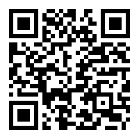

# Improvitouch 
A Computer Audition & Generative Music Project by Guilherme Silva Gama 

  Demo Video             |  [Live demo link](https://wafflesgama.github.io/Improvitouch/)
:-------------------------:|:-------------------------:
  |  

## Context of the work

The following work was developed focusing on the Computer Audition and Generative Music Project fields and belongs to the second deliverable project of the SDI curricular unit in the FEUP’s Master of Multimedia.

When a professional instrument player performs an improvised melody, based on harmonic accompaniment, he tends to have some degree of logical abstraction. The rhythm, tonality and harmonic rules integrate part of set of tools that the artist can rely unconsciously. This level of abstraction really provides the player a freedom of expression while still maintaining the melody auditorily coherent.

This project aims to design a proof of concept that allows any average user, with no or a minimal background in music theory, to improvise along a melody. Providing the entitled freedom of musical expression.

## Related works 

- Refraktions – Jason Snell
 “Refraktions”(*‎Refraktions on the App Store*, 2014) is an ios app that generates ambience MIDI sequences based on the user’s touch interaction. This app features eight concurrent MIDI tracks that can be manipulated individually. This collection of midi sequences is visually represented by circular shapes (to represent the loop time), light particles (to indicate the notes and accents played) and wave patterns (to represent the overall loop’s motifs).
Since this app is an ios exclusive product and reports a good performance, it is very likely that it was developed natively in the Apple ecosystem, using the Swift programming language.

# 

## Technical Architecture 

The core of this project was developed using the p5.js JavaScript library with the p5.sound submodule. All the audio files including the audio loop and the set of individual notes were recorded using Audacity and generated in Soundtrap(*Soundtrap - Wikipedia*, 2021) online DAW (*Digital Audio Workstation - Wikipedia*, 2021).

*Figure  SEQ Figure \\* ARABIC 3 - Screenshot of the midi recordings inside the DAW*

The main concept behind this system is that a simple chord projection plays in the background, continuously in loop, and the user can improvise along a melody with the smartphone touch sensors, using a pre-defined scale of notes.

For the implementation, there are two main features: The notes’ visual representation, and the Multi touch note-playing behavior. The notes visual representation is simply an animated image (representing a note) which spawns at the touch location, whenever a finger touches or slides into a new note. The note-playing behavior accounts for multiple touches and for hold and sliding scenarios without playing the same note repeatedly. The valid touches are assigned to their corresponding note based on the touch Y position on the screen. 

*Figure 2 – Two snippets of the system script: Visual particle’s behavior (left); Note playing behavior (right)*

## References

*Digital audio workstation - Wikipedia*. (2021). https://en.wikipedia.org/wiki/Digital\_audio\_workstation

Refraktions on the App Store*. (2014). https://apps.apple.com/us/app/refraktions/id866134037#?platform=iphone

*Soundtrap - Wikipedia*. (2021). https://en.wikipedia.org/wiki/Soundtrap

